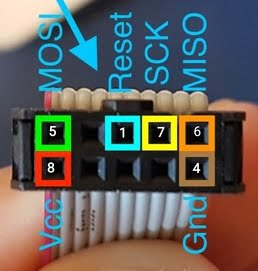

USBasp socket pinouts to an IC:


Tested WINDOWS software & Driver: `progisp` software & `Zadig (libusb-win32)` driver

Tested Android app: `ZFlasher AVR` app

To getting `rar` archives password, Run `getpass.ipynb`

#### AVR IC programming guide:

1- Write an `AVR` program in `C` programming language or other programing languages (`Python`, `Assembly`, ...).

2- Compile written `C` language `AVR` program with `avr-gcc`.

3- Build `hex` file with `avr-objcopy` from compiled `C` code.

4- Choose a programmer hardware among `Arduino uno`, `USBasp` and so on, Then Connect programmer pins to `AVR` IC pins according to provided user manuals and datasheets.

5- Install programmer software (`AVRDUDE`, `Arduino IDE`, `progisp`, `Zflasher AVR`, ...) and driver (`Zadiag`, ...) according to your OS. Then launch programmer software.

6- Upload `hex` file to `AVR` IC flash.

#### Build `hex`:

```
avr-gcc -g -Os -mmcu=see_docs -o main.elf main.c
```

```
avr-objcopy -j .text -j .data -O ihex main.elf main.hex
```

`-mmcu` option docs: `https://gcc.gnu.org/onlinedocs/gcc/AVR-Options.html`

Sample blink LED code:

```
#include <avr/io.h>
#include <util/delay.h>

#define LED_PIN PB4

int main(void) {

  // Configure LED_PIN (PB4) as output
  DDRB |= (1 << LED_PIN);

  while (1) {
    PORTB |= (1 << LED_PIN);
    _delay_ms(500);
    PORTB &= ~(1 << LED_PIN);
    _delay_ms(500);
  }

  return 0;
}
```

#### An idea:

Microcontrollers can be used as oscillator of ELF, VLF, LF, MF and HF analog and digital radio transmitters simply. There is a sample code in `samples` directory to generating semi sinewave signal with PWM module at an `AVR` IC.
